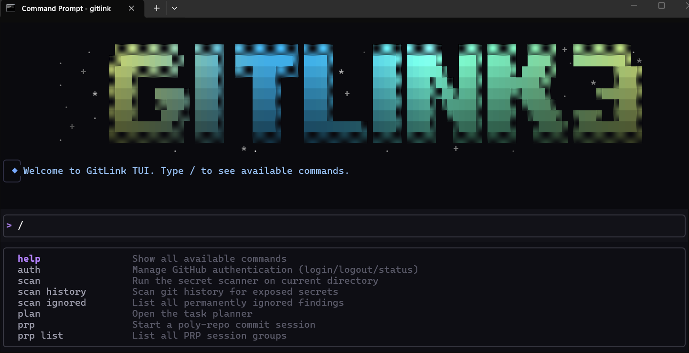
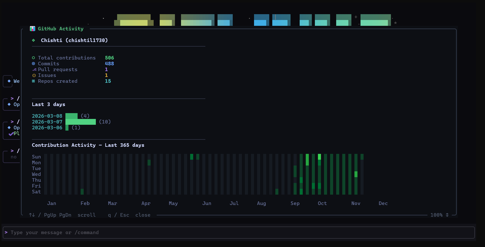
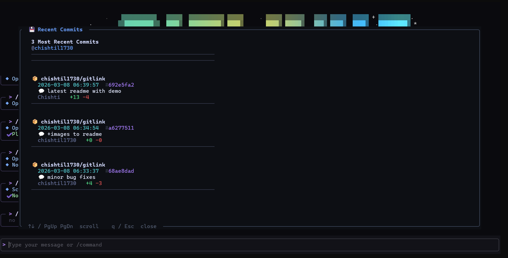
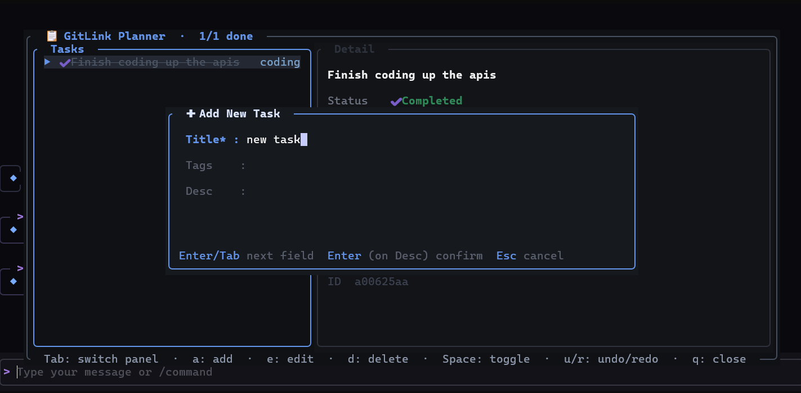

<div align="center">


**A fast, keyboard-driven terminal companion for GitHub — built in Rust.**

[](LICENSE)
[](https://github.com/chishtil1730/gitlink/releases)
[](#installation)
<br/>



<br/><br/>




<br/>



<br/>

</div>

---

GitLink brings your GitHub workflow into the terminal with a full TUI interface. Check sync status across repos, scan for leaked secrets, manage tasks, commit across multiple repos at once, and monitor contribution activity — without leaving your editor.

---

## Installation

### macOS (Homebrew)
```sh
brew tap chishtil1730/gitlink
brew install gitlink
```

### Windows

Download `gitlink.exe` from the [Releases](https://github.com/chishtil1730/gitlink/releases) page, or run:

```sh
curl -L https://github.com/chishtil1730/gitlink/releases/download/v0.1.1/gitlink.exe -o gitlink.exe
.\gitlink.exe
```

### Build from Source

**Requirements:** Rust 1.75+

```sh
git clone https://github.com/chishtil1730/gitlink
cd gitlink
cargo build --release
./target/release/gitlink
```

---

## Usage

```sh
gitlink
```

Once inside the TUI, type `/` to see all available commands. Use `↑ ↓` or `Tab` to navigate suggestions.

---

## Commands

| Command | Description |
|---|---|
| `/auth` | GitHub OAuth authentication |
| `/auth logout` | Remove stored token |
| `/auth status` | Check auth state |
| `/show-activity` | Contribution stats + 365-day heatmap |
| `/commits` | 3 most recent commits globally |
| `/pull-requests` | Open pull requests |
| `/repo-sync` | Sync status of current local repo |
| `/multi-sync` | Sync status across all your repos |
| `/push-check` | Check if latest commit is pushed |
| `/push-verify` | Preview unpushed commits |
| `/branches` | Local and remote branches |
| `/issues` | Open issues |
| `/user-info` | GitHub profile info |
| `/scan` | Scan working directory for secrets |
| `/scan history` | Scan git commit history |
| `/scan ignored` | Manage ignored findings |
| `/plan` | Open the task planner |
| `/prp` | Start a poly-repo commit session |
| `/prp list` | List PRP session groups |
| `/clear` | Clear output |
| `/quit` | Exit |

---

## Keyboard Shortcuts

| Key | Action |
|---|---|
| `/` | Start typing a command |
| `↑` `↓` | Navigate suggestions / scroll output |
| `Tab` | Autocomplete |
| `Enter` | Run command |
| `Ctrl+C` | Quit |
| `Esc` | Close overlay |
| `Space` | Toggle selection (multi-sync, prp) |

---

## Features

### GitHub Integration
Query your repos, PRs, issues, branches, sync status, and contribution heatmap directly from the terminal.

### Secret Scanner
Detects AWS keys, GitHub tokens, JWT tokens, Stripe keys, generic API keys, and PEM private keys using regex pattern matching and Shannon entropy analysis. Respects `.gitignore` and skips build artifacts automatically.

### Poly-Repo Hub (`/prp`)
Commit and push to multiple git repos in a single session. Shows a diff preview, takes one commit message, and applies it atomically with automatic rollback on failure.

### Task Planner (`/plan`)
Built-in task manager with add, edit, delete, complete, and full undo/redo. Tasks persist locally.

### Authentication
GitHub OAuth device flow — no PAT required. Run `/auth`, open a URL, approve. Token is stored in your system keychain, never in plaintext.

---

## Data Storage

| Location | Purpose |
|---|---|
| `.gitlinkignore.json` | Ignored scanner findings (project root) |
| `~/.gitlink/tasks.json` | Task planner data |
| `~/.gitlink/prp_groups.json` | PRP session history |
| System keychain | GitHub OAuth token |

---

## License

MIT — see [LICENSE](LICENSE).